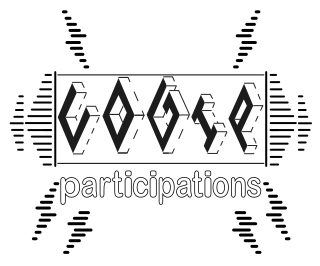
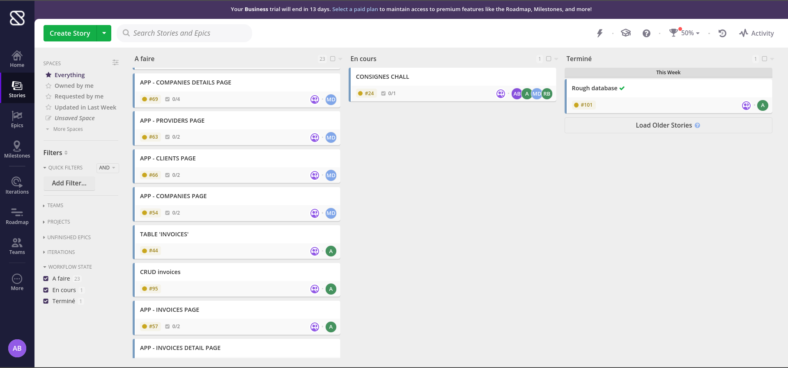
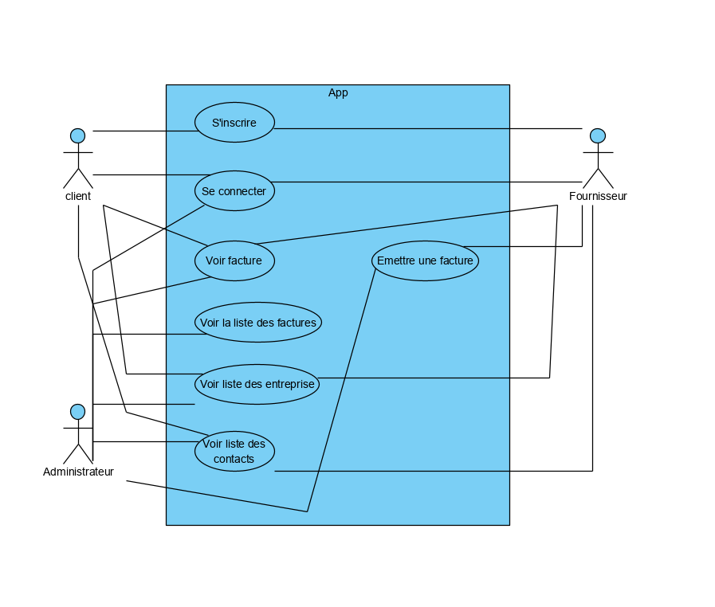
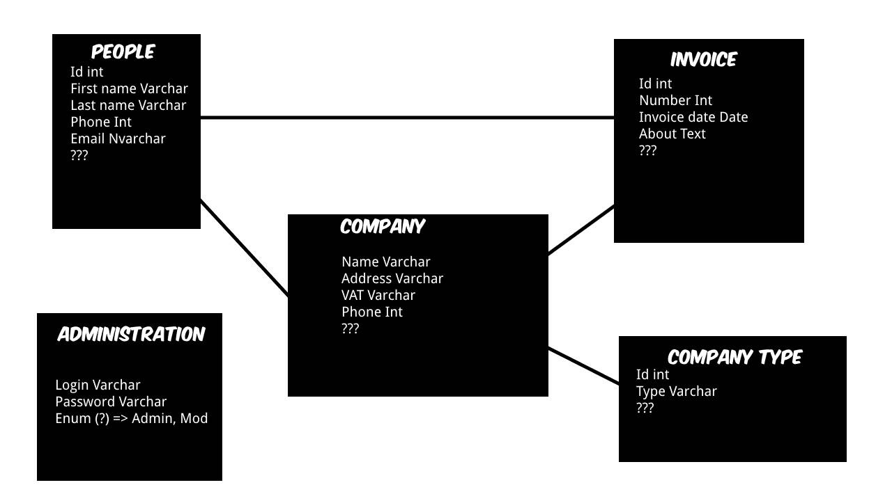

<h1 align="center">COGIP's invoicing app</h1>  

  

  
  
  
## About  
                          
**Authors:** [Aline Bosser](https://github.com/AlineBsr), [Anthony Lambert](https://github.com/Kaleidosport), [Messaoud Dorchies](https://github.com/MessDorchies) and [Romain Berthaux](https://github.com/kawtagan).  
**Subject:** Concluding group assignment within the scope of the Junior WebDev's training provided by [BeCode](https://github.com/becodeorg), PHP's latest bundle.  
**Start date:** November 29th 2021.  **End date:** December 10th 2021.  
**Self-hosted release:** [COGIP's app online](https://c0gip.000webhostapp.com/peopleController/getPeople).  
  
## Learning objectives  
> The bigger the scale, the faster one learns.
  
* To create an invoicing app for a fictional company named COGIP while using POO and SQL joins  
* To divide our workload in the smartest way, meaning communication was key all along  
* To shape the whole project while complying with a list of very detailed requirements  
* To deliver a polished, modernized version of the app based on outdated mockups  
* To make sure the whole project hinged on a proper MVC structure, which was a first for most of us  
* To get a first hands-on experience regarding users'permissions    
  
---  

## Work flow  
> A two-week sturdy, yet steady ride.  
  
### Getting a headstart  

Considering the countless, detailed instructions we had to take into account prior to coding anything, we relied on [Shortcut](https://app.shortcut.com) (formerly ClubHouse) to divide the workload in sizeable tasks. Those were assigned to the team members in a way we felt comfortable with since it matched the requirements, of which the need to each be in charge of a specific table. As such, we include a screenshot of our very own Shortcut dashboard hereafter for transparency purposes.  
  

  
      
Organizational considerations aside, we also agreed on the need to design core parts of the project to get a clearer idea of the aforementioned tasks. We wagered wisely by most accounts, judging by the small amounts of readjustments we've had to undertake further down the road. Rough as they may be, the following sketches tend to be proof thereof. Those cover pivotal thinking regarding both the classes and the database at stake.   
    

    
  
### On to the actual work  
  
Once we felt like we had all the bases covered, we committed to coding on the one end, skimming through endless documentation on the other end. What felt like bliss throughout the whole process is the first-rate communication between crewmates. Which is no understatement, considering this was definitely a challenging aspect in itself. As such, we dispatched the tasks at hand as per the following distribution.  
  
#### Aline    
> Tough adventurer in a jungle of commits  
* Github repository's management  
* People's table  
  * Relevant CRUD
  * Relevant pages
  * Relevant details page
* Hosting the project
* Global proofreading and attunement  
  
#### Anthony  
> Rough-and-tumble new PHP devotee in the becoming  
* Creating and editing the database
* Invoice's table  
  * Relevant CRUD
  * Relevant pages
  * Relevant details page
* Coming up with a prime README draft  
  
#### Mess  
> Technical lead from scratch
* MVC structure  
  * Controllers and models classes
* Setting up a functional router
* Company's table
  * Relevant CRUD
  * Relevant pages
  * Relevant details page
* Company type's table
  * Ibid for all things related to providers
  * Ibid for all things related to clients
* Administration's table
  * Depict a handy login system
  * Relevant access levels
  * Welcome page
  
#### Romain
> Creative pipework of a man  
* Recreating the COGIP's logo based on the movie "La personne aux deux personnes"
* Welcome page prior to letting Mess handle it
* Front-end perks  
  
---  

## The actual app
> So many things to do, so little time.  

Well, it's A-working. Diving deeper into our code, one will notice how the global folder proved pivotal with regards to maintaining an attuned structure. For the most part, we just had to use functions created at a preemptive stage. Mess'setup worked out all the way, so much so that we barely felt the need to adapt. This allowed us to fine-tune some features.  
  
We managed the necessary joins in the latest stages of the process, which leaves an end product worthy of the instructions. When all's said and done, it's safe to assume the challenge helped us get a better grasp of the whole MVC structure while enhancing our respective abilities to work as a team. All that's left is for J-C and his COGIP fellas to deliver the final blow...      
  
## Best of luck, J-C. Have fun with our crafty app, le temps d'une mise au point !  
> Our man's on a killin' spree. Or should we say our men?    
  
  